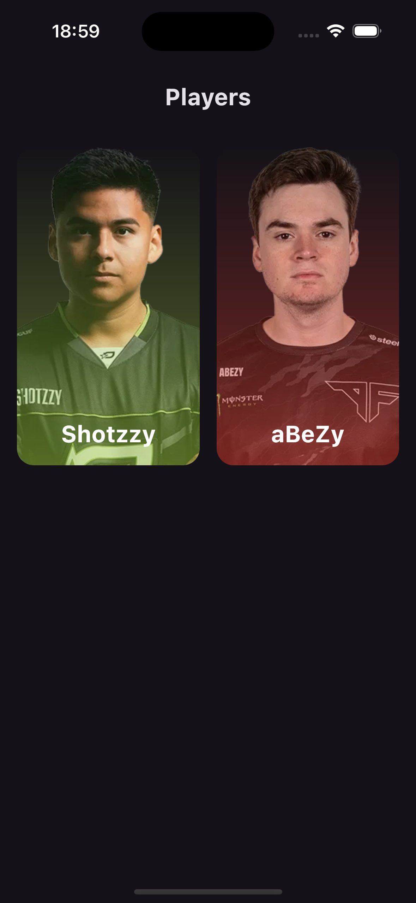

# 🚧 work in progress 🚧
Kotlin Multiplatform app to show [Call of Duty League](https://www.callofdutyleague.com/en-us/teams) player stats.

### Stack
- [Compose](https://www.jetbrains.com/de-de/compose-multiplatform/)
- [Coil](https://github.com/coil-kt/coil)
- [Koin](https://github.com/InsertKoinIO/koin)

### Preview
<ul>

</ul>
